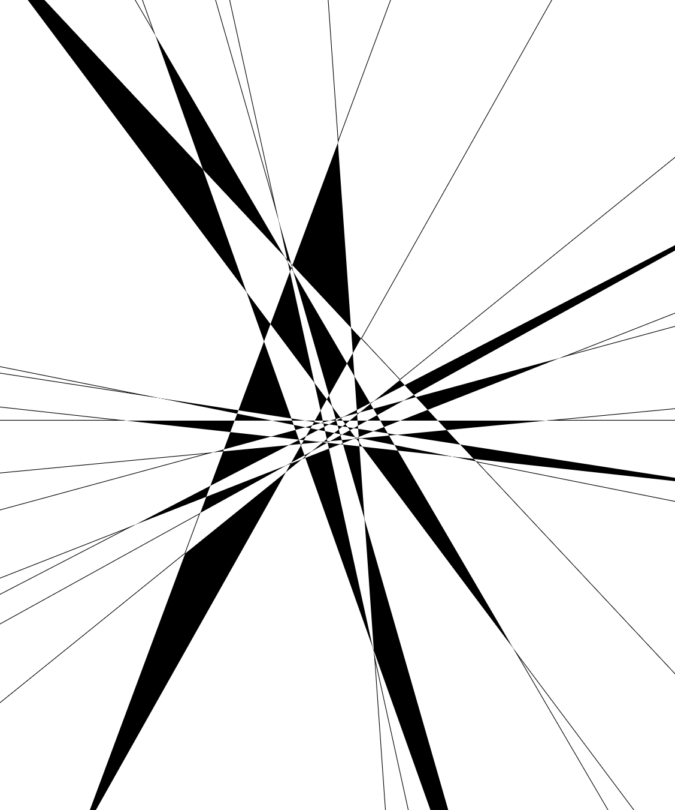

# The 18·2^t+1 Triangle-Maximal Series

Public repository for the certified `n=19` base configuration [used in the paper](https://arxiv.org/abs/2604.22035).

Paper: [arXiv:2604.22035](https://arxiv.org/abs/2604.22035) · [Gallery](https://parpalak.github.io/triangle-maximal-18-series/gallery/) · [Interactive viewer](https://parpalak.github.io/triangle-maximal-18-series/viewer/)

<p align="center">
  <a href="https://parpalak.github.io/triangle-maximal-18-series/gallery/">
    
  </a>
</p>

This repository is the artifact cited by the paper. It bundles:

- the paper source;
- the `n=19` input data;
- the certification scripts;
- the generated certificate files.

## Result

The verifier confirms that the arrangement realizes the given O-matrix, that `Y_0` touches 17 triangles, and that the arrangement has 107 bounded triangular faces.

## Reproduce the certificate

Run the two certification steps from [`verifier/`](./verifier):

```bash
cd verifier
python3 certify_interval.py \
  --lines ../data/n19/lines.csv \
  --omatrix ../data/n19/omatrix.json \
  --interval-certificate ../data/n19/interval_certificate.json
python3 certify_combinatorial.py \
  --omatrix ../data/n19/omatrix.json \
  --certificate ../data/n19/combinatorial_certificate.json
```

This writes:

- `data/n19/interval_certificate.json`
- `data/n19/combinatorial_certificate.json`

## Repository structure

- [`data/n19/`](./data/n19/README.md) — input data and generated certificates. See also [`FORMAT.md`](./data/n19/FORMAT.md) for field definitions.
- [`verifier/`](./verifier/README.md) — certification pipeline: scripts, commands, and tests.
- [`preprint/`](./preprint/) — paper source (LaTeX).
